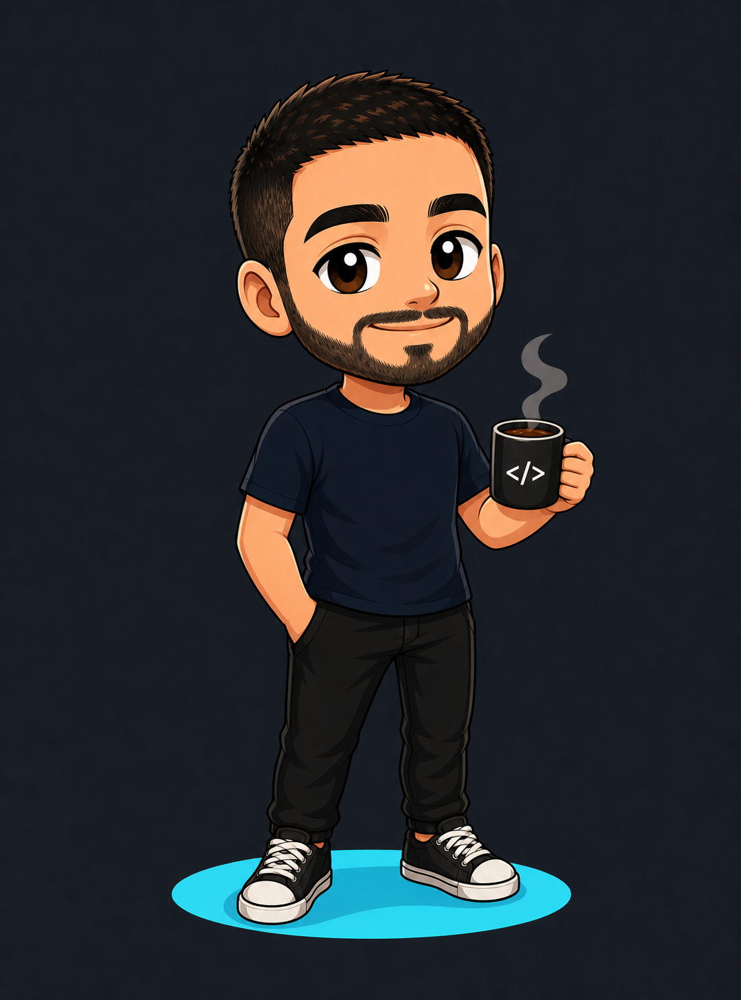
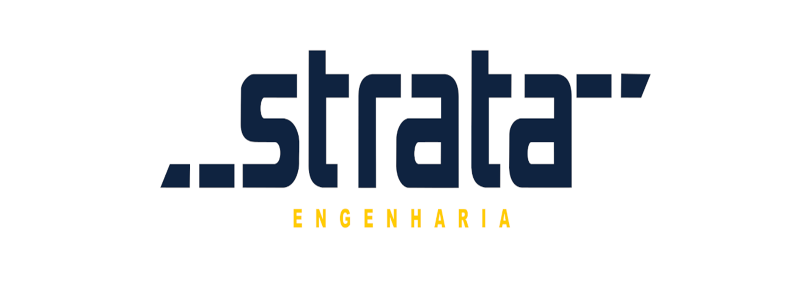

# Hey, I'm Leandro Alencar! 👋

### Software Engineering | System Architect | Fullstack Developer

- 📍 Living in Belo Horizonte, Minas Gerais, Brazil
- 💼 Fullstack Developer at **[Strata Engenharia](https://www.strata.com.br/)**
- 🎓 Software Engineering student at **[PUC Minas](https://www.pucminas.br/destaques/Paginas/default.aspx)**
- 🔗 Check out my portfolio: **[arsenal.dev.br](https://arsenal.dev.br/)**

---

### 🤝 Connect with Me

<strong>Click a button below to get in touch:</strong>

  
  &nbsp;&nbsp;&nbsp;
  
  &nbsp;&nbsp;&nbsp;
  

---

### 📖 About Me

I am a **Fullstack Developer** and **Software Engineering** student focused on building business-oriented software, from modular ERP systems and management platforms to REST APIs, desktop applications, automations, and AI-powered workflows.

My work connects backend, frontend, data modeling, integrations, and operations. I have worked with ERP modules for finance, inventory, sales, CRM, NF-e/NFC-e integrations, automated WhatsApp flows, RPA processes, n8n agents, computer vision, and applied AI solutions. My main stack includes **Java, Spring Boot, JavaFX, Node.js, React, PostgreSQL, MySQL, Selenium, RPA, computer vision, and AI agents**.

---

## Tech Skills

<table>
<tr>
<td width="33%" valign="top">
<h3 align="center">Languages</h3>

  
  
  
  
  
  
  

</td>

<td width="33%" valign="top">
<h3 align="center">Frontend</h3>

  
  
  
  
  
  

</td>

<td width="33%" valign="top">
<h3 align="center">Backend & APIs</h3>

  
  
  
  
  
  

</td>
</tr>

<tr>
<td width="33%" valign="top">
<h3 align="center">Apps & UI</h3>

  
  
  
  
  

</td>

<td width="33%" valign="top">
<h3 align="center">AI & Automation</h3>

  
  
  
  
  
  

</td>

<td width="33%" valign="top">
<h3 align="center">QA & Integrations</h3>

  
  
  
  
  
  

</td>
</tr>

<tr>
<td width="33%" valign="top">
<h3 align="center">Data & Messaging</h3>

  
  
  
  
  
  

</td>

<td width="33%" valign="top">
<h3 align="center">Cloud & DevOps</h3>

  
  
  
  
  
  

</td>

<td width="33%" valign="top">
<h3 align="center">Tools & Observability</h3>

  
  
  
  
  
  

</td>
</tr>
</table>

---

## Professional Experience

<table>
<tr>
<td width="50%" align="center">
  
</td>
<td width="50%" align="center">
  
</td>
</tr>
<tr>
<td width="50%" valign="top">
  <h3>Strata Engenharia</h3>
  
<strong>Junior Fullstack Developer</strong> May 2026 - Present

  <ul>
    <li>Development of a management web platform using <strong>React</strong> on the frontend and <strong>Node.js</strong> on the backend.</li>
    <li>Development and implementation of features supported by <strong>Artificial Intelligence</strong> techniques.</li>
    <li>Work with <strong>computer vision</strong> for object detection, segmentation, and tracking.</li>
    <li>Testing, adjustments, maintenance, and technical support for developed applications.</li>
    <li>Support in user training for implemented solutions.</li>
  </ul>
  
<strong>Stack:</strong> 
    
    
    
    
    
    
  

</td>
<td width="50%" valign="top">
  <h3>Fast Tennis</h3>
  
<strong>AI Agents Engineer Intern / RPA Developer Intern</strong> Oct 2025 - Apr 2026

  <ul>
    <li>Development of an AI agent in n8n for automated first-experience scheduling via WhatsApp.</li>
    <li>Integration between WhatsApp, n8n, and Zoho, converting conversations into tickets and improving support and bug management.</li>
    <li>Creation of an RD Station sales funnel exporter for analysis and commercial tracking.</li>
    <li>Process automation with RPA and initial refactoring of agents into Python.</li>
  </ul>
  
<strong>Stack:</strong> 
    
    
    
    
    
    
    
    
    
  

</td>
</tr>
</table>

<table>
<tr>
<td width="50%" align="center">
  
</td>
<td width="50%" align="center">
  
</td>
</tr>
<tr>
<td width="50%" valign="top">
  <h3>PUC Minas</h3>
  
<strong>Modular Programming Tutor</strong> Jul 2025 - Oct 2025

  <ul>
    <li>Technical guidance for students in programming logic, OOP, and best practices for modular development.</li>
  </ul>
  
<strong>Base:</strong> 
    
    
    
    
    
  

</td>
<td width="50%" valign="top">
  <h3>Legnu INFORTEC</h3>
  
<strong>Junior Fullstack Developer / Java</strong> Jan 2020 - Oct 2025

  <ul>
    <li>Development of ERP systems with <strong>Java 21</strong>, JavaFX desktop applications, and Spring Boot.</li>
    <li>Database modeling with MySQL/PostgreSQL and complex business rules for finance, inventory, sales, and CRM.</li>
    <li>Integrations with NF-e/NFC-e and document generation using iText and JasperReports.</li>
    <li>Creation of REST APIs, legacy refactoring, and application of Git-based best practices.</li>
  </ul>
  
<strong>Stack:</strong> 
    
    
    
    
    
    
    
    
    
    
  

</td>
</tr>
</table>

---

## Education

- **Software Engineering - PUC Minas** 
  **Level:** Bachelor's Degree 
  2024 - 2027

- **Electronics Technician - SENAI Horto** 
  **Level:** Technical Degree 
  2022 - 2023

---

## GitHub Metrics

